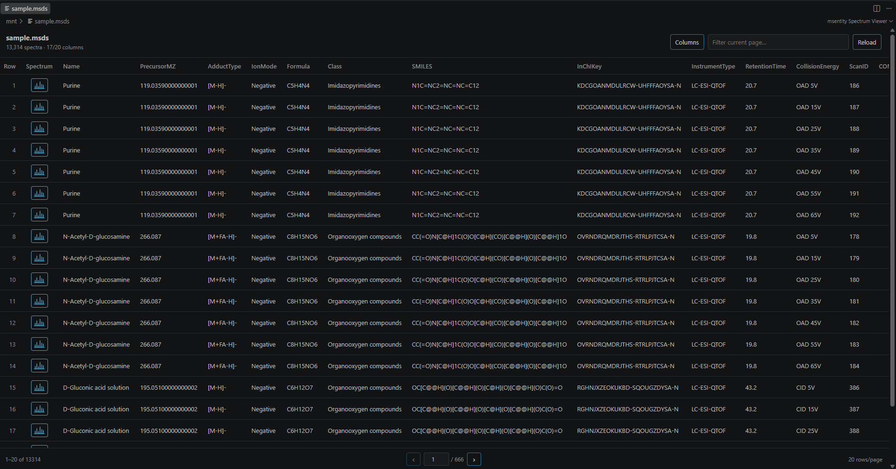
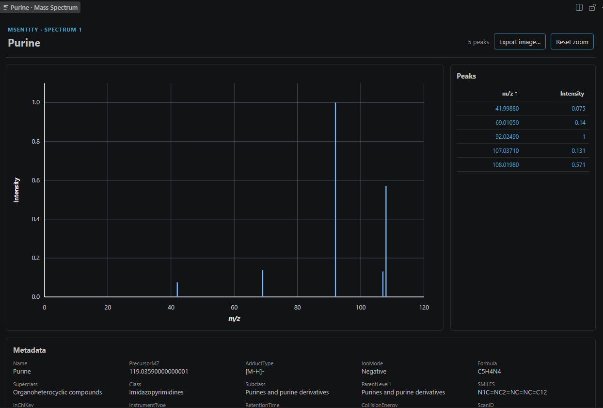

<h1> msentity</h1>

[](https://opensource.org/licenses/MIT)  
  
[](https://msentity.readthedocs.io)

---

**msentity** is a lightweight Python toolkit for reading, representing, and
manipulating mass-spectrometry datasets. It combines pandas-based spectrum
metadata with compact peak storage and provides MSP, MGF, and native MSDS I/O.

Use it from Python, the command line, an interactive dataset shell, or the
included VS Code spectrum viewer.

---

## Documentation

Full documentation is available at:

https://msentity.readthedocs.io

---

## Basic installation

Install directly from GitHub:

```console
python -m pip install "msentity @ git+https://github.com/MotohiroOGAWA/msentity.git"
```

This installs the Python API, command-line tools, and interactive shell. The
VS Code extension is distributed as a separate VSIX from this same repository.

## Command-line usage

Inspect or convert a dataset without writing Python:

```console
msentity info sample.msp
msentity head sample.msp --num-rows 5
msentity convert sample.msp sample.msds
```

Run `msentity --help` to see all commands, including directory merging and
MSDS metadata inspection.

## Interactive shell

Open an MSP, MGF, or MSDS file in a dataset-oriented prompt:

```console
msentity shell sample.msp
```

The shell is intended for quick inspection and preprocessing. Its commands
include `info`, `head`, `show`, `peaks`, `filter`, `sort`, `normalize`,
`specid`, `peakid`, `reset`, and `export`.

```text
msentity shell
Type 'help' to show commands. Type 'exit' to quit.

msentity> info
msentity> filter PrecursorMZ > 300
msentity> peaks 0 --top 10 --sort intensity
msentity> export filtered.msds
```

Use `help <command>` inside the shell for command-specific options. Filtering
and sorting operate on the current dataset view; `reset` restores the complete
view.

## VS Code spectrum viewer

Download the
[latest `msentity-spectrum-viewer.vsix`](https://github.com/MotohiroOGAWA/msentity/releases/latest/download/msentity-spectrum-viewer.vsix),
then install it from a terminal. This URL always points to the newest release,
so no version needs to be specified:

```console
code --install-extension ./msentity-spectrum-viewer.vsix
```

Alternatively, open VS Code's Extensions view, choose **Views and More
Actions (...) → Install from VSIX...**, and select the downloaded file. Run
**Developer: Reload Window** after installation. The Python environment selected
by `msentitySpectrumViewer.pythonPath` must have `msentity` installed.

Open an `.msds`, `.msp`, or `.mgf` file and click a spectrum row to display its
mass spectrum. The viewer supports peak selection and sorting, drag-to-zoom,
zoom-dependent readable axis ticks, and previewed transparent PNG/SVG export.
The complete loaded dataset can also be converted and saved as MSDS, MSP, MGF,
or TSV directly from the viewer.
File extensions are used for automatic input detection. To specify the input
format explicitly—including TSV—right-click a file in Explorer and choose **MS Entity: Open
as MSDS**, **Open as MSP**, **Open as MGF**, or **Open as TSV**; the same commands are available
from the Command Palette. **Export...** asks for MSDS, MSP, MGF, or TSV before the
save location, so the output format is explicit and the matching extension is
applied automatically.
The export dialog can independently include tick grid lines, tick numbers, and
m/z labels above peaks; grid lines, tick numbers, and peak labels are off by
default. Without tick numbers, exported axis titles and margins are compacted.



The dataset editor provides paging, filtering, column selection, and a spectrum
button for each row. Selecting a spectrum updates one reusable plot panel:



To build the VSIX yourself:

```console
git clone https://github.com/MotohiroOGAWA/msentity.git
cd msentity/vscode-extension
npm ci
npm run package
```

This creates
`vscode-extension/dist/msentity-spectrum-viewer-<version>.vsix`, where
`<version>` comes from `vscode-extension/package.json`. See the
[extension README](vscode-extension/README.md) and the
[viewer documentation](https://msentity.readthedocs.io/en/latest/vscode_viewer.html)
for setup, settings, development, and release instructions.
